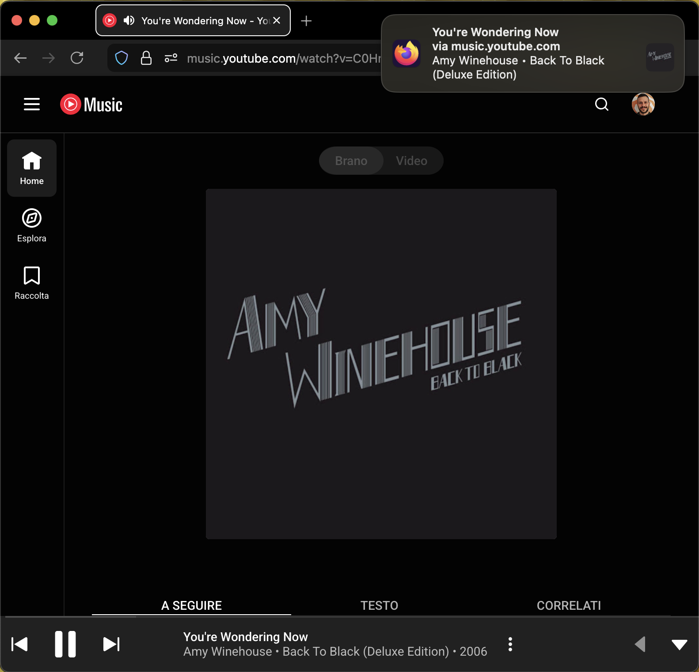
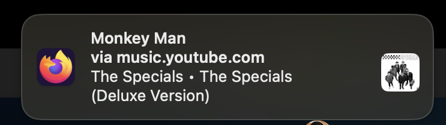

#  ytm-notifier

**ytm-notifier** is a Firefox add-on that enables native macOS notifications for YouTube Music.

A notification will popup everytime a new song is played.

Its implementation followed the [KISS](https://en.wikipedia.org/wiki/KISS_principle) principle.

## Screenshots

YouTube Music Player

Notification detail

---

##### Credits

<a href="https://www.flaticon.com/free-icons/play-button" title="play button icons">Play button icons created by Alfredo Hernandez - Flaticon</a>
